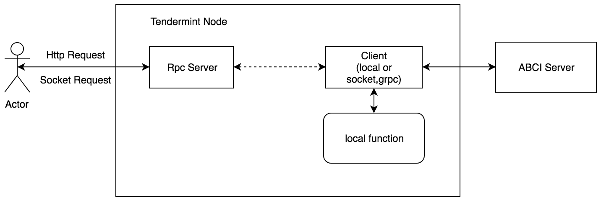
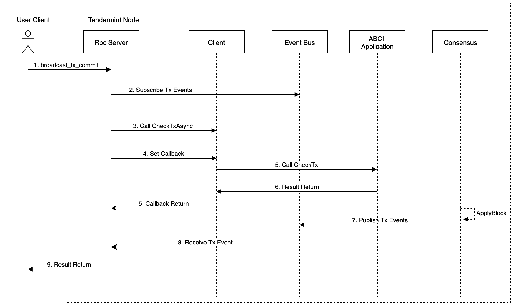

# Life cycle of a request in tendermint

## Terminology

#### ABCI 
`ABCI` is the abbreviation of `Application BlockChain Interface`. [Here](https://github.com/tendermint/abci) is the reference. As described in the doc:

>`ABCI` is an interface that defines the boundary between the replication engine (the blockchain), and the state machine (the application). Using a socket protocol, a consensus engine running in one process can manage an application state running in another.
>Previously, the ABCI was referred to as TMSP.


## Simple Life cycle of  a request



1. User will send a http request or socket request through cli command or through code to interact with tendermint node.
2. Rpc server which started with the tendermint node will receive the request.
3. According to the request received, tendermint node will decide to call synchronized method or asynchonized method of client. client will call local function or rpc method of ABCI application to execute the logic. 

### Key Components Related

Below are some key components related to the processing of a request. Components like consensus, p2p and store are not included. They will be introduced in other documentations.

####  Application
``` go
// Application is an interface that enables any finite, deterministic state machine
// to be driven by a blockchain-based replication engine via the ABCI.
// All methods take a RequestXxx argument and return a ResponseXxx argument,
// except CheckTx/DeliverTx, which take `tx []byte`, and `Commit`, which takes nothing.
type Application interface {
	// Info/Query Connection
	Info(RequestInfo) ResponseInfo                // Return application info
	SetOption(RequestSetOption) ResponseSetOption // Set application option
	Query(RequestQuery) ResponseQuery             // Query for state

	// Mempool Connection
	CheckTx(tx []byte) ResponseCheckTx // Validate a tx for the mempool

	// Consensus Connection
	InitChain(RequestInitChain) ResponseInitChain    // Initialize blockchain with validators and other info from TendermintCore
	BeginBlock(RequestBeginBlock) ResponseBeginBlock // Signals the beginning of a block
	DeliverTx(tx []byte) ResponseDeliverTx           // Deliver a tx for full processing
	EndBlock(RequestEndBlock) ResponseEndBlock       // Signals the end of a block, returns changes to the validator set
	Commit() ResponseCommit                          // Commit the state and return the application Merkle root hash
}
```

`Application` consists of the ABCI methods.

ABCI Applications such as `BinaceChain` and `BaseApp` implement `Application` interface.


#### Client

``` go
// Client defines an interface for an ABCI client.
// All `Async` methods return a `ReqRes` object.
// All `Sync` methods return the appropriate protobuf ResponseXxx struct and an error.
// Note these are client errors, eg. ABCI socket connectivity issues.
// Application-related errors are reflected in response via ABCI error codes and logs.
type Client interface {
	cmn.Service

	SetResponseCallback(Callback)
	Error() error

	FlushAsync() *ReqRes
	EchoAsync(msg string) *ReqRes
	InfoAsync(types.RequestInfo) *ReqRes
	SetOptionAsync(types.RequestSetOption) *ReqRes
	DeliverTxAsync(tx []byte) *ReqRes
	CheckTxAsync(tx []byte) *ReqRes
	QueryAsync(types.RequestQuery) *ReqRes
	CommitAsync() *ReqRes
	InitChainAsync(types.RequestInitChain) *ReqRes
	BeginBlockAsync(types.RequestBeginBlock) *ReqRes
	EndBlockAsync(types.RequestEndBlock) *ReqRes

	FlushSync() error
	EchoSync(msg string) (*types.ResponseEcho, error)
	InfoSync(types.RequestInfo) (*types.ResponseInfo, error)
	SetOptionSync(types.RequestSetOption) (*types.ResponseSetOption, error)
	DeliverTxSync(tx []byte) (*types.ResponseDeliverTx, error)
	CheckTxSync(tx []byte) (*types.ResponseCheckTx, error)
	QuerySync(types.RequestQuery) (*types.ResponseQuery, error)
	CommitSync() (*types.ResponseCommit, error)
	InitChainSync(types.RequestInitChain) (*types.ResponseInitChain, error)
	BeginBlockSync(types.RequestBeginBlock) (*types.ResponseBeginBlock, error)
	EndBlockSync(types.RequestEndBlock) (*types.ResponseEndBlock, error)
}
```

`Client` provides synchronized methods and asynchronized methods to call ABCI appliction. It's used by tendermint node to call rpc methods of ABCI application or local methods of ABCI application if ABCI application is integrated  with the tendermint node.

`localClient`, `socketClient` and `grpcClient`  implement the `Client` interface and they are used to used to call local functions or rpc methods.

For example, if we start the tendermint node with the command `tendermint node`, tendermint node will construct a `socketClient` which connected to `tcp://127.0.0.1:26658` to perform the ABCI function.
In the other case, if we start the tendermint node with the command `tendermint node --proxy_app=kvstore`, tendermint node will generate a `localClient` to call the functions of the kvstore application.

#####  socket client
In function `OnStart`, client will start two goroutine which handle requests and responses asynchronously. 
``` go
func (cli *socketClient) OnStart() error {
	...
	go cli.sendRequestsRoutine(conn)
	go cli.recvResponseRoutine(conn)
	...
}
```
In function `recvResponseRoutine`,  client will handle each response. then it will notify reqRes listener and client listener(aka response callback) if set.

``` go
func (cli *socketClient) recvResponseRoutine(conn net.Conn) {

	r := bufio.NewReader(conn) // Buffer reads
	for {
		var res = &types.Response{}
		err := types.ReadMessage(r, res)
		...
		switch r := res.Value.(type) {
		...
		default:
			err := cli.didRecvResponse(res)
			...
		}
	}
}


func (cli *socketClient) didRecvResponse(res *types.Response) error {
	cli.mtx.Lock()
	defer cli.mtx.Unlock()
	...
	// Notify reqRes listener if set
	if cb := reqres.GetCallback(); cb != nil {
		cb(res)
	}

	// Notify client listener if set
	if cli.resCb != nil {
		cli.resCb(reqres.Request, res)
	}

	return nil
}
```

 
 In tendermint node, response callback is always set and it will add tx into mempool's `txs` if response's status is right.


#### EventBus

``` go
// EventBus is a common bus for all events going through the system. All calls
// are proxied to underlying pubsub server. All events must be published using
// EventBus to ensure correct data types.
type EventBus struct {
	cmn.BaseService
	pubsub *tmpubsub.Server
}
```

Event messages are published through event bus，and we can subscribe events we interested. Below are reserved event types.

``` go
// Reserved event types
const (
	EventBond              = "Bond"
	EventCompleteProposal  = "CompleteProposal"
	EventDupeout           = "Dupeout"
	EventFork              = "Fork"
	EventLock              = "Lock"
	EventNewBlock          = "NewBlock"
	EventNewBlockHeader    = "NewBlockHeader"
	EventNewRound          = "NewRound"
	EventNewRoundStep      = "NewRoundStep"
	EventPolka             = "Polka"
	EventRebond            = "Rebond"
	EventRelock            = "Relock"
	EventTimeoutPropose    = "TimeoutPropose"
	EventTimeoutWait       = "TimeoutWait"
	EventTx                = "Tx"
	EventUnbond            = "Unbond"
	EventUnlock            = "Unlock"
	EventVote              = "Vote"
	EventProposalHeartbeat = "ProposalHeartbeat"
)
```

For example, after a block is commited, validator will publish new block event,  tx events and so on.

``` go 
func (blockExec *BlockExecutor) ApplyBlock(state State, blockID types.BlockID, block *types.Block) (State, error) {
	
	... 
	
	// events are fired after everything else
	// NOTE: if we crash between Commit and Save, events wont be fired during replay
	fireEvents(blockExec.logger, blockExec.eventBus, block, abciResponses)

	return state, nil
}

// Fire NewBlock, NewBlockHeader.
// Fire TxEvent for every tx.
// NOTE: if Tendermint crashes before commit, some or all of these events may be published again.
func fireEvents(logger log.Logger, eventBus types.BlockEventPublisher, block *types.Block, abciResponses *ABCIResponses) {
	eventBus.PublishEventNewBlock(types.EventDataNewBlock{block})
	eventBus.PublishEventNewBlockHeader(types.EventDataNewBlockHeader{block.Header})

	for i, tx := range block.Data.Txs {
		eventBus.PublishEventTx(types.EventDataTx{types.TxResult{
			Height: block.Height,
			Index:  uint32(i),
			Tx:     tx,
			Result: *(abciResponses.DeliverTx[i]),
		}})
	}
}

```

and in api `broadcast_tx_commit`, we subscribe tx event from event bus. When a tx is included in a block, we will receive the tx we interested.

``` go
func BroadcastTxCommit(tx types.Tx) (*ctypes.ResultBroadcastTxCommit, error) {
	// subscribe to tx being committed in block
	deliverTxResCh := make(chan interface{})
	q := types.EventQueryTxFor(tx)
	err := eventBus.Subscribe(ctx, "mempool", q, deliverTxResCh)
	...
	// Wait for the tx to be included in a block,
	// timeout after something reasonable.
	// TODO: configurable?
	timer := time.NewTimer(60 * 2 * time.Second)
	select {
	case deliverTxResMsg := <-deliverTxResCh:
		deliverTxRes := deliverTxResMsg.(types.EventDataTx)
		// The tx was included in a block.
		deliverTxR := deliverTxRes.Result
		logger.Info("DeliverTx passed ", "tx", cmn.HexBytes(tx), "response", deliverTxR)
		return &ctypes.ResultBroadcastTxCommit{
			CheckTx:   *checkTxR,
			DeliverTx: deliverTxR,
			Hash:      tx.Hash(),
			Height:    deliverTxRes.Height,
		}, nil
	case <-timer.C:
		logger.Error("failed to include tx")
		return &ctypes.ResultBroadcastTxCommit{
			CheckTx:   *checkTxR,
			DeliverTx: abci.ResponseDeliverTx{},
			Hash:      tx.Hash(),
		}, fmt.Errorf("Timed out waiting for transaction to be included in a block")
	}
}
```

## Detailed life cycle of a request



#### description of components
1. User Client: User client is a client that send requests to tendermint node. It can be a shell command like curl, socket client or something else.
2. Rpc Server: Rpc Server is a server started with tendermint node which can handle clients' connection and requests.
3. Client: Client is a proxy that can execute ABCI application functions through local function calls or rpc calls to ABCI server. It depends on is ABCI application integrated with tendermint node or does ABCI application start standalone as a server.
4. Event Bus: As mentioned above, event bus is a common bus for all events like tx events going through the system. We can subcribe to the event bus for txs we interested in. And txs will be published to event bus by publisher.
5. ABCI Application: ABCI Application is an application integrated with tendermint node or a server started standalone.
6. Consensus: Consensus is the consensus part of tendermint which can produce blocks.

#### steps of request
We take `broadcast_tx_commit` which is relatively complicated as an example.

1. We send a `broadcast_tx_commit` request to tendermint node through  a command like `curl 'http://localhost:26657/broadcast_tx_commit?tx="hello"'`. The result will be returned when the block is committed.
2. Rpc Server will receive the command and it will subcribe to the event bus for tx events after block is committed.
3. Then Rpc Server will use Client as a proxy to call ABCI method `CheckTx` through the function `CheckTxAsync` which call `CheckTx` asynchronically. 
4. A callback which will be called after `CheckTx` returned by ABCI Application will be set.
5. Client will call `CheckTx` of ABCI Application.
6. And wait for the return of result.
7. When the result is returned, callback will be notified by Client. Thereby we will know if the tx is validated and we will wait the tx to be included in a block.
8. After consensus is reached, a block will be committed and txs included in the block will be executed through ABCI Application. After block is committed, tx events and other events will be published to Event Bus.
9. Finally, Rpc Server will receive the tx event it subscribed.
10. And client will receive the final result from Rpc Server.